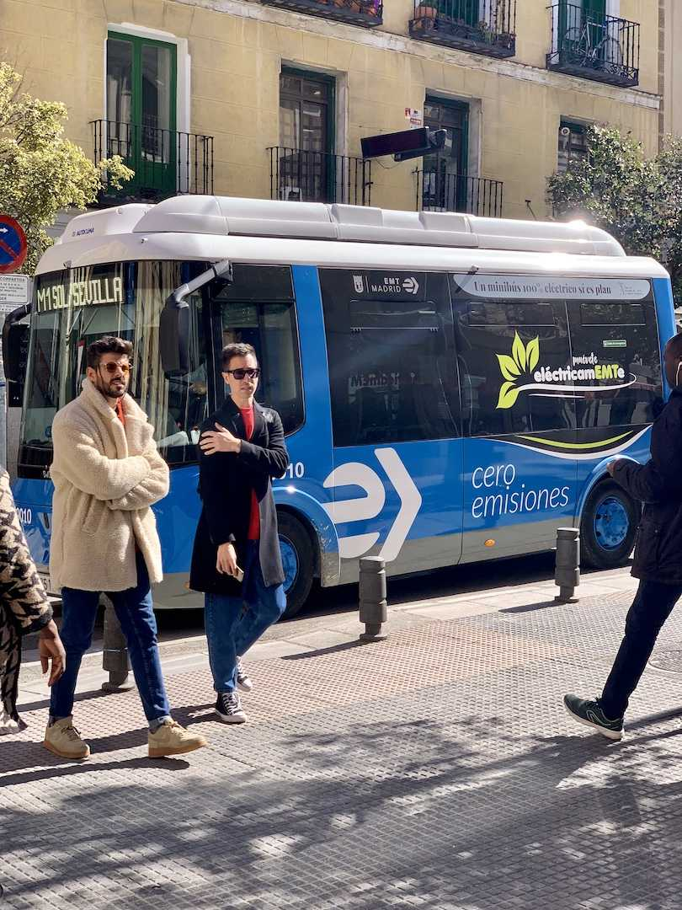
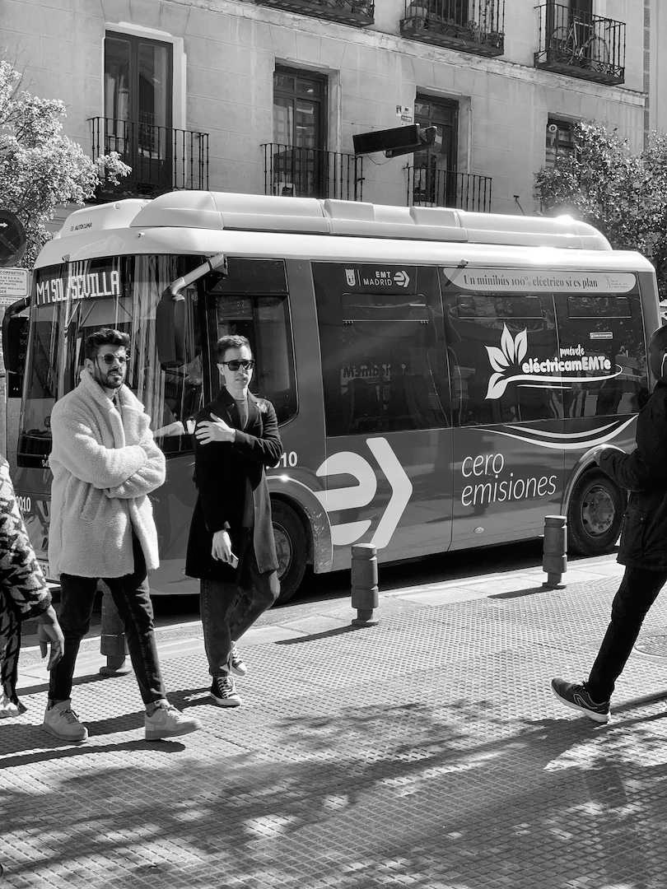
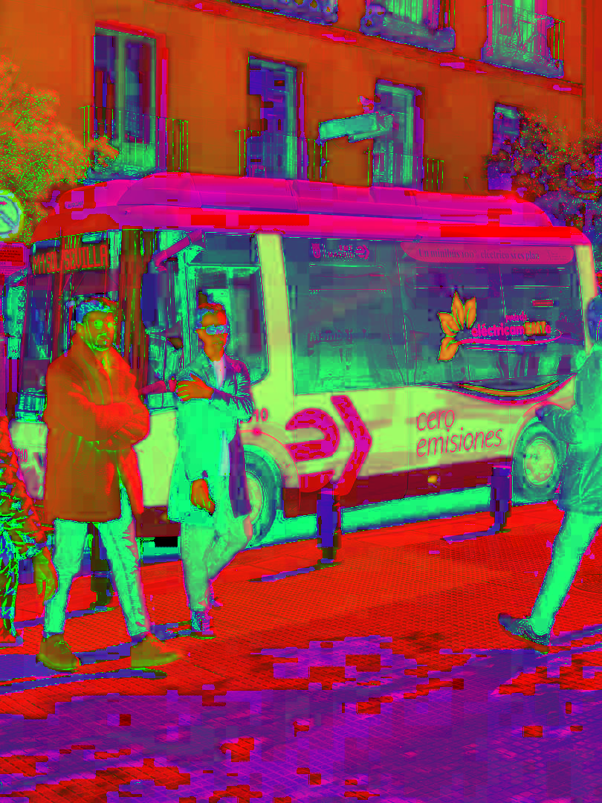
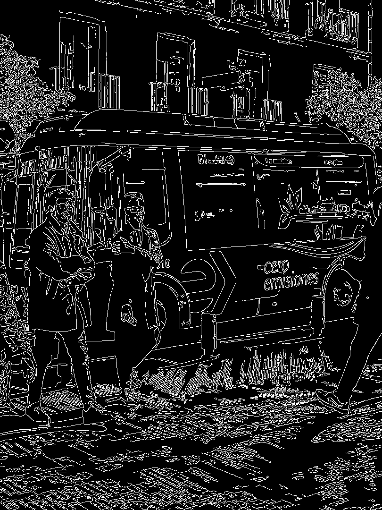
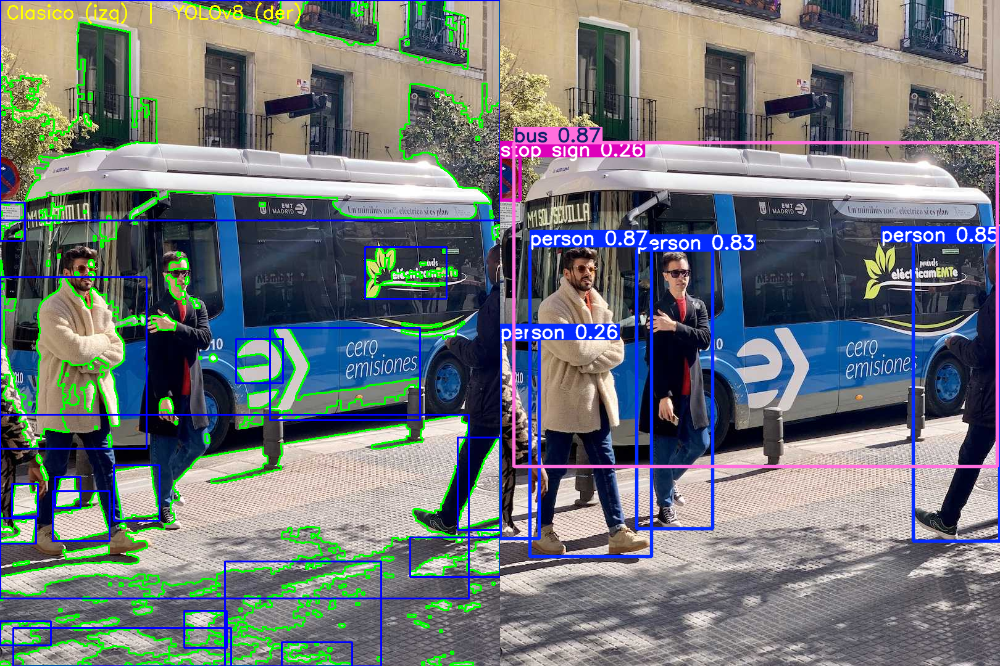
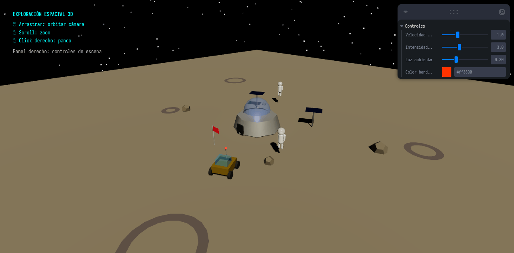
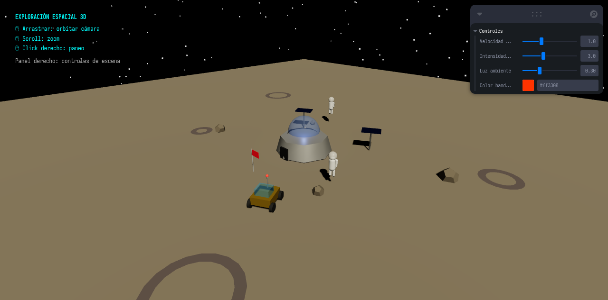
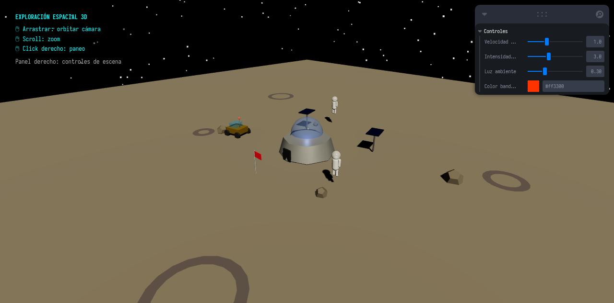

<div align="center">

# Examen Final — Computación Visual 2026-I

**Universidad Nacional de Colombia**  
Computación Visual · Parte práctica · Entrega individual

**Gabriel Anzola** · `ganzola@unal.edu.co`

---


</div>

---

## Tabla de contenido

1. [Descripción general](#descripción-general)
2. [Ejercicio 1 — Procesamiento visual e IA](#ejercicio-1--procesamiento-visual-e-ia)
3. [Ejercicio 2 — Escena 3D interactiva](#ejercicio-2--escena-3d-interactiva)
4. [Instalación y ejecución](#instalación-y-ejecución)
5. [Estructura del repositorio](#estructura-del-repositorio)
6. [Análisis técnico y decisiones](#análisis-técnico-y-decisiones)
7. [Dificultades y soluciones](#dificultades-y-soluciones)
8. [Uso de IA](#uso-de-ia)

---

## Descripción general

Repositorio de entrega del examen final práctico de Computación Visual 2026-I. Contiene dos ejercicios independientes que integran procesamiento de imágenes, visión por computador, gráficos 3D, materiales, animación e interacción.

| | Ejercicio 1 | Ejercicio 2 |
|---|---|---|
| **Tema** | Procesamiento visual e IA | Escena 3D interactiva |
| **Stack** | Python 3.12 · OpenCV · YOLOv8 | React Three Fiber · Three.js · Vite |
| **Entorno** | uv (Python) | npm (Node 26) |
| **Entrada** | Imagen estática (`bus.jpg`) | — |
| **Salida** | 6 PNGs + comparativo | Escena 3D en el navegador |

---

## Ejercicio 1 — Procesamiento visual e IA

### Propósito

Pipeline secuencial de visión por computador que aplica 8 operaciones obligatorias sobre una imagen estática, generando resultados comparables en cada etapa. Combina técnicas clásicas de OpenCV con detección mediante modelo preentrenado YOLOv8n.

### Pipeline — resultados visuales

Los 6 archivos exigidos se generan en `ejercicio_1_procesamiento_visual/resultados/`:

<table>
  <tr>
    <td align="center"><b>① Original</b><br></td>
    <td align="center"><b>② Escala de grises</b><br></td>
    <td align="center"><b>③ Espacio HSV</b><br></td>
  </tr>
  <tr>
    <td align="center"><b>④ Suavizado Gaussiano</b><br></td>
    <td align="center"><b>⑤ Bordes Canny</b><br></td>
    <td align="center"><b>⑥ Detección clásica + YOLOv8</b><br></td>
  </tr>
</table>

### Parámetros y decisiones técnicas

| Operación | Elección | Parámetros | Justificación |
|-----------|----------|------------|---------------|
| Espacio de color alt. | HSV | — | Separación intuitiva de matiz y saturación; útil para segmentar por color |
| Suavizado | Gaussiano | kernel `(5,5)`, σ=0 | Reduce ruido de alta frecuencia sin distorsionar bordes |
| Detección de bordes | Canny | low=`50`, high=`150` | Ratio 1:3 estándar para contraste medio; supresión de no-máximos incluida |
| Segmentación | Otsu | — | Umbral automático adaptado a la distribución de grises |
| Morfología | OPEN → CLOSE | kernel `5×5` | Elimina ruido pequeño y rellena huecos en contornos |
| Modelo preentrenado | YOLOv8n | conf=`0.25` | Nano = más ligero; detecta 6 objetos: bus, 4×persona, señal stop |

### Cómo ejecutar

```bash
cd ejercicio_1_procesamiento_visual
uv sync                          # instala Python 3.12 + deps en .venv
uv run python src/main.py        # genera resultados/
```

> La primera ejecución descarga `yolov8n.pt` (~6 MB) automáticamente. El peso **no se versiona** (excluido en `.gitignore`).

### Resultados obtenidos

- 6 PNGs exigidos + `comparativo.png` (mosaico de todos los pasos).
- YOLOv8n detectó **6 objetos**: `bus`, `person ×4`, `stop sign` con conf ≥ 0.25.
- Segmentación clásica: **127 contornos** encontrados con Otsu + morfología.

---

## Ejercicio 2 — Escena 3D interactiva

### Propósito

Escena 3D de **exploración espacial** (base lunar, rover, astronautas, paneles solares) que demuestra los requisitos obligatorios del PDF: jerarquía de objetos, transformaciones, cámara interactiva, materiales PBR, iluminación con sombras, animaciones `useFrame`, interacción entre elementos e interacción del usuario.

### Demo

<p align="center">
  
</p>

### Capturas

<table>
  <tr>
    <td align="center"><b>Vista principal</b><br></td>
    <td align="center"><b>Animación en curso</b><br></td>
  </tr>
</table>

### Controles de usuario

| Control | Acción |
|---------|--------|
| Arrastrar (clic izquierdo) | Orbitar cámara alrededor de la escena |
| Scroll | Zoom in/out |
| Clic derecho + arrastrar | Paneo de cámara |
| Slider **Velocidad rover** | Cambia la velocidad de desplazamiento orbital |
| Slider **Intensidad sol** | Ajusta la luz direccional (amanecer ↔ mediodía) |
| Slider **Luz ambiente** | Controla iluminación ambiental |
| Color picker **Color bandera** | Cambia el color de la bandera de la base |

### Checklist de requisitos obligatorios

| Requisito PDF | Implementación |
|---------------|----------------|
| ✅ Escena 3D completa | Base lunar + domo de vidrio + suelo con cráteres y rocas + estrellas |
| ✅ Jerarquía de objetos | `Rover` (padre) → cuerpo + ruedas×4 + cabina + antena; `SolarPanel` → soporte + panel |
| ✅ Traslación | Rover en órbita circular, paneles y astronautas en posiciones distintas |
| ✅ Rotación | Antena rotatoria, paneles orientándose al rover, astronautas oscilando |
| ✅ Escala | Geometrías con distintas escalas; rocas con tamaños diferenciales |
| ✅ Cámara interactiva | `OrbitControls` (orbit, zoom, pan); límites `minDistance=3`, `maxDistance=40` |
| ✅ Materiales PBR | `meshStandardMaterial` (metalness/roughness) + `meshPhysicalMaterial` (transmission) |
| ✅ Iluminación coherente | `directionalLight` (sol) + `ambientLight` (fría) + `pointLight` (base); sombras activas |
| ✅ Animaciones (`useFrame`) | Rover orbital, antena rotatoria, astronautas flotando, paneles siguiendo rover |
| ✅ Interacción entre elementos | Bandera → amarillo cuando rover pasa cerca; astronauta saluda cuando rover < 5u |
| ✅ Interacción del usuario | `OrbitControls` (mouse) + 4 controles Leva (sliders + color picker) |

### Cómo ejecutar

```bash
cd ejercicio_2_escena_3d_interactiva
npm install
npm run dev      # → http://localhost:5173/
```

Para producción:
```bash
npm run build && npm run preview
```

---

## Instalación y ejecución

### Dependencias del sistema

| Herramienta | Versión mínima | Uso |
|-------------|----------------|-----|
| [uv](https://docs.astral.sh/uv/) | 0.11+ | Gestor de entornos Python |
| Python | 3.12 (gestionado por uv) | Ejercicio 1 |
| Node.js | ≥ 18 | Ejercicio 2 |
| npm | ≥ 9 | Ejercicio 2 |

### Ejercicio 1 — paso a paso

```bash
# 1. Entrar al directorio
cd ejercicio_1_procesamiento_visual

# 2. Instalar dependencias (Python 3.12 + OpenCV + NumPy + Ultralytics)
uv sync

# 3. Ejecutar el pipeline completo
uv run python src/main.py

# Opcional: imagen personalizada
uv run python src/main.py --input ruta/imagen.jpg --output resultados/
```

### Ejercicio 2 — paso a paso

```bash
# 1. Entrar al directorio
cd ejercicio_2_escena_3d_interactiva

# 2. Instalar dependencias Node
npm install

# 3. Servidor de desarrollo
npm run dev
# Abrir http://localhost:5173/ en el navegador
```

---

## Estructura del repositorio

```
examen-final-computacion-visual-gabriel-anzola/
├── README.md                                    ← este archivo
├── .gitignore
├── CLAUDE.md                                    ← guía de trabajo
├── todo.md                                      ← plan por fases (todas ✅)
├── examen_final_computacion_visual_2026I_practico.pdf
│
├── ejercicio_1_procesamiento_visual/
│   ├── src/
│   │   └── main.py                              ← pipeline completo (8 operaciones)
│   ├── data/
│   │   └── entrada.jpg                          ← imagen de entrada
│   ├── resultados/
│   │   ├── original.png                         ← paso 1
│   │   ├── grises.png                           ← paso 2
│   │   ├── hsv_o_lab.png                        ← paso 3
│   │   ├── suavizado.png                        ← paso 4
│   │   ├── bordes.png                           ← paso 5
│   │   ├── deteccion_o_segmentacion.png         ← paso 6 (exigido)
│   │   └── comparativo.png                      ← mosaico extra
│   ├── pyproject.toml
│   ├── uv.lock
│   └── README.md
│
└── ejercicio_2_escena_3d_interactiva/
    ├── src/
    │   ├── App.jsx                              ← escena 3D completa
    │   └── main.jsx
    ├── media/
    │   ├── captura_1.png
    │   ├── captura_2.png
    │   └── demo.gif                             ← animación (260 KB)
    ├── index.html
    ├── vite.config.js
    ├── package.json
    └── README.md
```

---

## Análisis técnico y decisiones

### Ejercicio 1

**¿Qué problema aborda?**  
Demostra un pipeline reproducible de visión por computador que procesa una imagen real mediante operaciones secuenciales clásicas y detección moderna con IA, generando evidencia visual en cada etapa.

**Decisiones de diseño:**

- **HSV vs LAB**: se eligió HSV por su separación semántica de tono/saturación, más intuitiva para analizar objetos con colores distinguibles como vehículos y señales.
- **Gaussiano vs Mediana**: Gaussiano `(5,5)` se eligió porque preserva mejor los gradientes necesarios para Canny; la mediana es más robusta al ruido sal-pimienta pero menos adecuada aquí.
- **Canny low=50, high=150**: ratio 1:3 recomendado por Canny (1986); captura bordes fuertes sin exceso de ruido.
- **Otsu automático**: elimina la necesidad de fijar un umbral manual; óptimo para bimodalidades claras.
- **YOLOv8n (nano)**: versión más ligera, descarga rápida (~6 MB), suficiente para demostrar detección en tiempo real en imágenes con pocas clases.

### Ejercicio 2

**¿Qué problema aborda?**  
Construir una escena 3D interactiva temática que demuestre los fundamentos de gráficos por computador: jerarquía de objetos, ciclo de renderizado, materiales físicamente basados, iluminación, animación y feedback al usuario.

**Decisiones de diseño:**

- **React Three Fiber vs Unity**: R3F elegido por ser 100% web (sin instalación), reproducible en cualquier máquina con un navegador, y por mantener el repo ligero (sin assets binarios pesados).
- **`meshPhysicalMaterial` con `transmission`**: permite simular vidrio real (cabina del rover, domo de la base) con refracción, imposible con `meshStandardMaterial`.
- **Leva para controles**: panel de sliders inmediato sin boilerplate; permite ajustar velocidad, iluminación y color en tiempo real mostrando interacción del usuario claramente.
- **Órbita circular del rover**: trayectoria predecible que garantiza que el rover pase por la bandera y cerca de los astronautas, haciendo visible la interacción entre elementos.

---

## Dificultades y soluciones

| Dificultad | Causa | Solución |
|---|---|---|
| OpenCV/ultralytics sin wheels | Python 3.14 (sistema) no tiene wheels binarios | `uv python pin 3.12` + `requires-python = ">=3.12"` |
| `npm create vite` cancelado | Directorio con subcarpetas preexistentes | Scaffold manual: `package.json` + `vite.config.js` + `index.html` |
| WebGL negro en headless | Chromium headless desactiva WebGL por seguridad | Flag `--enable-unsafe-swiftshader` |
| GIF sin animación | Cada lanzamiento de Chromium inicia estado fresco | CDP (Chrome DevTools Protocol) con WebSocket: sesión persistente, 14 frames a 500 ms |

---

## Uso de IA

**Asistente utilizado:** Claude Sonnet 4.6  
El proyecto se desarrolló en sesión iterativa con el asistente, donde cada prompt correspondió a una fase de trabajo concreta.

---

### Fase 0 — Inicialización del repositorio

> "Necesito inicializar un repo git para mi examen final de Computación Visual. El repositorio debe llamarse `examen-final-computacion-visual-gabriel-anzola`. Crea la estructura de carpetas: `ejercicio_1_procesamiento_visual/{src,data,resultados}` y `ejercicio_2_escena_3d_interactiva/{src,media}`, con `.gitkeep` en los vacíos. Genera un `.gitignore` que cubra Python/uv, Node/Vite, pesos de modelos `.pt`, macOS y Linux. Primer commit y crea el repo remoto público en GitHub con `gh`."

---

### Fase 1 — Entorno Python con uv

> "Configura el entorno Python para el ejercicio 1 usando `uv`. El sistema tiene Python 3.14 pero OpenCV y ultralytics no tienen wheels para esa versión. Haz `uv init`, fija Python 3.12 con `uv python pin`, ajusta `requires-python` en `pyproject.toml`, y agrega `opencv-python`, `numpy` y `ultralytics`. Muestra cómo hacer smoke test de las tres dependencias."

> "El `uv python pin 3.12` falla porque `pyproject.toml` tiene `requires-python = '>=3.13'`. Corrígelo y vuelve a ejecutar el pin."

---

### Fase 2 — Pipeline OpenCV

> "Implementa `src/main.py` con el pipeline completo de 8 operaciones: (1) cargar imagen con `cv2.imread` y validar, (2) escala de grises, (3) conversión a HSV, (4) suavizado gaussiano con kernel `(5,5)`, (5) Canny con umbrales 50/150, (6a) segmentación clásica con threshold Otsu + morfología OPEN→CLOSE + `findContours` + bounding boxes, (6b) detección YOLOv8n con conf=0.25, (7) guardar todos los resultados intermedios con los nombres exactos del PDF, (8) panel comparativo. Usar argparse. Imprimir en consola todos los parámetros usados para trazabilidad."

> "El modelo YOLOv8 se descarga en el directorio de trabajo como `yolov8n.pt`. Asegúrate de que `.gitignore` ya cubre `*.pt` para no versionar los pesos."

---

### Fase 3 — Entorno React Three Fiber

> "Quiero crear un proyecto Vite + React en `ejercicio_2_escena_3d_interactiva/` pero `npm create vite@latest . -- --template react` cancela porque el directorio ya tiene las subcarpetas `src/` y `media/`. ¿Cómo lo resuelvo sin borrar las carpetas existentes?"

> "Haz el scaffold manual: crea `package.json` con React 18, `@react-three/fiber`, `@react-three/drei`, `leva`, Three.js 0.170 y Vite 6. Crea `vite.config.js`, `index.html` y `src/main.jsx`. Verifica que `npm run build` compile sin errores."

---

### Fase 4 — Escena 3D de exploración espacial

> "Implementa la escena 3D completa en `src/App.jsx`. Tema: exploración espacial (base lunar). Requisitos obligatorios: (1) jerarquía de objetos — `Rover` como grupo padre con ruedas×4, cuerpo, cabina de vidrio y antena rotatoria como hijos; `SolarPanel` con soporte y panel como hijos; (2) transformaciones explícitas de traslación/rotación/escala; (3) `OrbitControls` con límites; (4) `meshStandardMaterial` con metalness/roughness y `meshPhysicalMaterial` con transmission para vidrio; (5) `directionalLight` tipo sol cálido + `ambientLight` frío + `pointLight` de la base, sombras activadas; (6) animaciones con `useFrame`: rover en órbita circular, antena rotatoria, astronautas flotando, paneles orientándose hacia la posición del rover; (7) interacción entre elementos: bandera se pone amarilla cuando el rover pasa cerca, astronautas saludan (brazo oscila) cuando el rover está a menos de 5 unidades; (8) controles Leva con sliders de velocidad del rover, intensidad solar, luz ambiente y color picker para la bandera."

> "La escena funciona pero hay un componente `Scene` que quedó sin usar en el archivo. Elimínalo para mantener el código limpio."

---

### Fase 5 — Evidencias visuales

> "El servidor Vite corre en localhost:5173. Necesito capturas de la escena 3D. Usa `chromium --headless=new` para tomar screenshots pero el canvas aparece negro. ¿Qué flag falta para que Three.js renderice en modo headless?"

> "Tengo 14 frames PNG de la escena tomados con chromium headless + swiftshader. Úsalos para crear un GIF animado con Pillow optimizado para tamaño (target < 500 KB). Paleta adaptativa de 256 colores, duración 250 ms por frame."

---

### Fase 6 — Verificación

> "Borra `resultados/` completamente y vuelve a correr `uv run python src/main.py` desde cero para confirmar reproducibilidad. Muéstrame el output completo con los nombres de los 6 archivos generados y sus tamaños."

> "Corre `npm run build` en `ejercicio_2_escena_3d_interactiva/` y confirma que compila sin errores."

---

### Fase 7 — Documentación

> "Escribe el `README.md` principal del repo con badges de shields.io, imágenes embebidas del pipeline en tabla HTML 3×2, GIF de la escena centrado, tabla de controles, checklist de requisitos del PDF, análisis técnico de decisiones, tabla de dificultades/soluciones, y sección de uso de IA con prompts por fase. El correo del estudiante es `ganzola@unal.edu.co`."

---

### Qué se verificó manualmente

- **Ej1**: inspección visual de los 6 PNGs (grises correctos, HSV con matiz visible, suavizado apreciable al comparar con original, bordes Canny nítidos sobre objetos principales, cajas YOLOv8 sobre personas y bus con etiquetas).
- **Ej2**: apertura de la escena en navegador con WebGL activo; prueba de OrbitControls (orbit, zoom, pan); observación de cada animación en tiempo real; cambio de color de bandera al paso del rover; respuesta de todos los sliders Leva.
- **Reproducibilidad**: entorno Python reconstruido desde cero con `uv sync`; proyecto Node con `npm ci` + `npm run build` sin errores.
